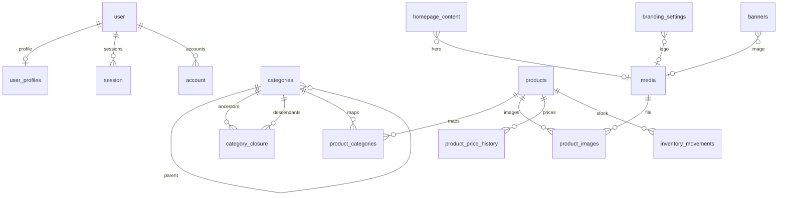

# Schema

Logical ER overview. All application tables use UUID primary keys except singleton CMS rows (`homepage_content`, `branding_settings`) which are constrained to `id = 1`.

## Auth (Better Auth)

- `user`, `session`, `account`, `verification`, `rate_limit`
- Username plugin columns: `user.username`, `user.display_username`

## Authorization

- `user_profiles(user_id, role, must_change_password, password_changed_at)`
- `role` enum: `ADMIN | CUSTOMER`

## Catalog

- `categories(id, parent_id, name, slug, sort_order, is_active, timestamps)`
- `category_closure(ancestor_id, descendant_id, depth)` including self rows at depth 0
- `products(id, name, slug, description, sku, price_amount numeric(12,2), currency, stock_quantity, is_active, timestamps)`
- `product_categories(product_id, category_id)`
- `product_images(id, product_id, media_id, sort_order, is_primary)` with a unique partial index for a single primary image

## Inventory and pricing history

- `inventory_movements(product_id, previous_quantity, new_quantity, quantity_delta, reason, actor_user_id, created_at)`
- `product_price_history(product_id, previous_amount, new_amount, currency, actor_user_id, created_at)`

## CMS

- `homepage_content` singleton: store story + hero media
- `branding_settings` singleton: store name + logo
- `contact_fields`: typed, ordered, activatable rows (phone/email/address/whatsapp/facebook/custom)
- `banners`: title, subtitle, media, link, location, schedule, active flag
- `site_settings`: JSON bag for future keys

## Media

- `media(url, storage_key, media_type, original_filename, alt_text, width, height, sort_order, created_at)`

## Future orders / payments

Not created in v1. New `orders` / `order_items` / `payments` tables should reference `products.id` (and later variant ids) without altering the product PK strategy.
